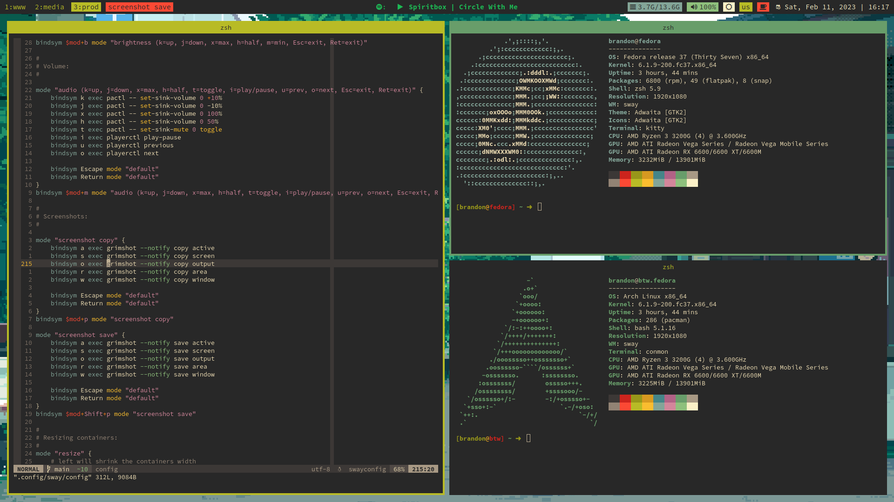
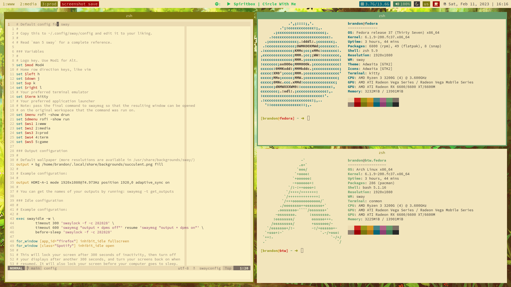

# Gruvbox Comfy Sway setup
My bloated Gruvbox swaywm configuration 

# About
This configuration is meant to be used with my main dotfiles in 
[TWB0109/dotifles](https://github.com/TWB0109/dotfiles.git)

# Screenshots




# Video Demonstration


# Dependencies

- [stow](https://www.gnu.org/software/stow/)
- [swaywm](https://swaywm.org/)
- [rofi-wayland](https://fedora.pkgs.org/37/fedora-x86_64/rofi-wayland-1.7.5+wayland1-1.fc37.x86_64.rpm.html)
- [kitty](https://sw.kovidgoyal.net/kitty/)
- [waybar](https://github.com/Alexays/Waybar)
- [darkman](https://gitlab.com/WhyNotHugo/darkman) for changing system variant (dark or light) globally and in specific apps through the scripts in [dark-mode.d](https://github.com/TWB0109/sway/tree/main/.local/share/dark-mode.d) and in [light-mode.d](https://github.com/TWB0109/sway/tree/main/.local/share/light-mode.d)
- [swww](https://github.com/Horus645/swww) for animated wallpapers in [Videos/Hanabi](https://github.com/TWB0109/sway/tree/main/Videos/Hanabi)
- ddcutil for brightness control
- playerctl for MPRIS control
- pactl for volume control (also works with PipeWire)
- grimshot for screenshots (see modes "screenshot save" and "screenshot copy") in sway/config
- wlsunset for blue color filter

# Usage/Installation

To install this configuration, the main tool we'll use is GNU Stow, please make
sure it's installed and look up the name of the package in your distribution of
choice

## GNU Stow Installation For Fedora 37
```bash
dnf install stow
```

## Installation of the config

There are two ways of doing it:

1. Cloning the whole setup
```bash
git clone https://github.com/TWB0109/dotfiles ~/dotfiles
cd ~/dotfiles
stow sway # X meaning any folder in the repo that you'd like to install as your config, please back up your configs first.
```
2. Cloning just the sway setup:
```bash
git clone https://github.com/TWB0109/sway ~/sway/sway
cd ~/sway
stow sway
```
